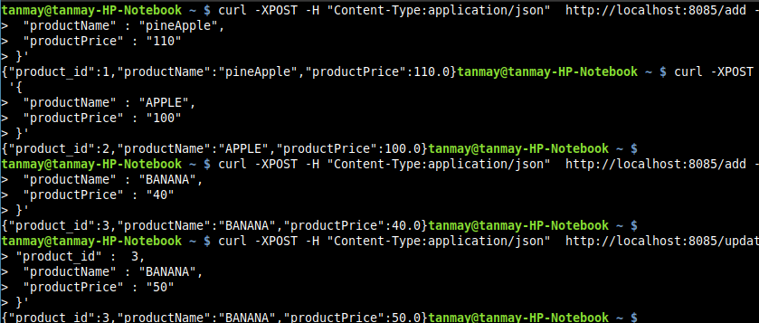

# CQRS Pattern With Event Sourcing


In this Project there are 2 services:
1) Product Command Service 
2) Product Query Service
 
## Working
- The Product command Service provides the Creation, Update and Delete Operations via REST API Endpoints.
- The product Query Services provides REST Endpoints to fetch the products.
- Product command Service receives the product details which includes product_name, product price and creates ProductEvent.
- ProductEvent has all the attributes of the ProductEntity along with additional Attribute EventStatus which is an enum.
- Valid values are CREATED, UPDATED AND DELETED.
- Based on the operation it adds the EventStatus and all the attributes of ProductEntity and publishes ProductEvent on Queue product-queue. (You can use Exchange as well which is bound to one or many queues)
- The product-query-service subscribes to product-queue.
- It processes the ProductEvent and persists in its own independent database.
- Thus the query responsibility is segregated from the command responsibility via Event Sourcing mechanism.

## Steps:
- Maven Build all the 3 components.
  - common
  - command-service
  - query-service
- Start both the services

## Pre-requisites
1) RabbitMQ running locally or inside the container.

`docker pull rabbitmq:3.9.29-management-alpine`

2) Start the docker Container of RabbitMQ

```sudo docker run --hostname localhost -p5672:5672 -p15672:15672 -p15692:15692 -p5671:5671 -p15691:15691 -p25672:25672 rabbitmq:3.9.29-management-alpine```

3) Create queue : `product-queue`


## Tests

- On startup open the h2-console on port 8085 and 8086 for the two services.
- You will be able to see that there is empty `PRODUCT` table in both the databases.


- There are 3 CRUD Operations:
   - Create
   - Update
   - Delete

1) Create Product Scenario :

`curl -XPOST -H "Content-Type:application/json"  http://localhost:8085/add -d '{
   "productName" : "pineApple",
   "productPrice" : "110"
   }'`


- You can observe that the product is persisted in command service database.

- In the logs of command service you will observe that ProductEvent is published.

- In the logs of query service you will observe that the ProductEvent is received.

- You can observe that the product is persisted in query service database.

- You can access the product using the GET APi exposed by Query Service


- Create few more products

- `curl -XPOST -H "Content-Type:application/json"  http://localhost:8085/add -d '{
"productName" : "APPLE",
"productPrice" : "100"
}'`


- `curl -XPOST -H "Content-Type:application/json"  http://localhost:8085/add -d '{
"productName" : "BANANA",
"productPrice" : "40"
}'`

  
2) Update Product 
- `curl -XPOST -H "Content-Type:application/json"  http://localhost:8085/update -d '{
  "product_id" :  3,
  "productName" : "BANANA",
  "productPrice" : "50"
  }'
  `


- Command Service DB:
  

- Query Service DB:
  


3) Delete Product:
`curl -X DELETE http://localhost:8085/delete?productId=3`


- You can see that the product has been deleted from the Query Service Database as well.


- Thus, CQRS Pattern seperates the Create, Update and Delete Operations in a seperate Service and Query Operations as a seperate Service.

